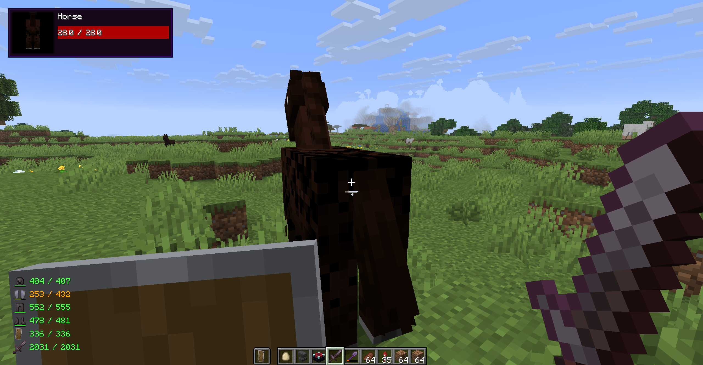
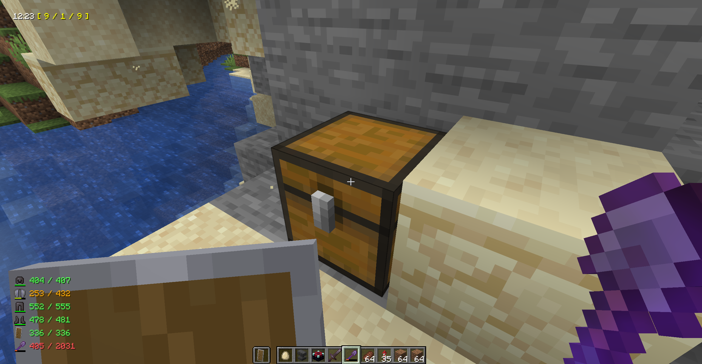

# StatusHUD

**StatusHUD** is a lightweight client-side mod for Minecraft (NeoForge) that enhances your in-game HUD with useful real-time indicators. It is designed to provide quick access to important gameplay information without cluttering the screen.

## Features

- Damage Indicator
- Durability Indicator (Armor, Tool, Shield)

- InGame Time Indicator
- Target Position Indicator (chunk coordinates), very helpful for finding buried treasures.

## Configuration

All features can be enabled / disabled / customized via the config file.

### General Options

| Option | Type | Default | Description |
|--------|------|---------|-------------|
| `bEnableDamageIndicator` | Boolean | `true` | Enables or disables the damage indicator on the HUD. |
| `bEnableDurabilityIndicator` | Boolean | `true` | Enables or disables the display of all durability indicators together. |
| `bEnableArmorDurabilityIndicator` | Boolean | `true` | Enables or disables the display of the currently equipped armor's remaining durability. |
| `bEnableShieldDurabilityIndicator` | Boolean | `true` | Enables or disables the display of the currently equipped shield's remaining durability. |
| `bEnableToolDurabilityIndicator` | Boolean | `true` | Enables or disables the display of the currently equipped tool's remaining durability. |
| `bEnableStatusIndicator` | Boolean | `true` | Enables or disables the display of the upper status line on the HUD. |

---

### Damage Indicator

| Option | Type | Default | Description |
|--------|------|---------|-------------|
| `fDamageIndicatorRaycastDistance` | Float | `30.0` | Sets the maximum distance (in blocks) at which the damage indicator can detect entities. Vanilla distance is 3. |

---

### Status Indicator Format

| Option                            | Type | Default                                                                                              | Description                                                                                                                                                                                                                                                                                                                                                                         |
|-----------------------------------|------|------------------------------------------------------------------------------------------------------|-------------------------------------------------------------------------------------------------------------------------------------------------------------------------------------------------------------------------------------------------------------------------------------------------------------------------------------------------------------------------------------|
| `sStatusIndicatorFormat` | String | `$sGameTime24 \| &FF00FF00;$sPlayerName&FFFFFFFF; \| $sPlayTime \| &FFFFFF00;$sTargetsChunkPosition` | Custom format for the upper HUD line. Supports new lines (`\n`), ARGB color codes (`&AARRGGBB;`) and variables:  • `$sGameTime24` → in-game time (24h)  • `$sGameTime12` → in-game time (12h)  • `$sPlayerName` → player’s name  • `$sPlayTime` → real time played in world  • `$sTargetsChunkPosition` → position the block you are looking at in chunk coordinates |

---

### Durability Indicator Format

| Option | Type | Default | Description |
|--------|------|---------|-------------|
| `sDurabilityIndicatorFormat` | String | `$iCurrentDurability/$iMaxDurability ($fCurrentDurabilityPercent%)` | Custom format for armor, shield, and tool durability. Supports variables:  • `$iCurrentDurability` → current durability  • `$iMaxDurability` → maximum durability  • `$fCurrentDurabilityPercent` → durability percentage |

---

## Installation

1. Install **NeoForge** for your Minecraft version.
2. Download the latest release of **StatusHUD**.
3. Place the `.jar` file into your `mods` folder.
4. Launch the game.

---

## License

This project is licensed under the **GNU General Public License v3.0**.  
You are free to use, modify, and distribute this software under the same license.

See the `LICENSE` file for more details.

---

## Notes

- This mod is entirely client-side.
- Built to be minimalistic and non-intrusive, keeping your HUD clean.
- Fully configurable through the standard NeoForge configuration system.
- Inspired by classic mods such as Damage Indicators and Armor Status HUD, as well as many other discontinued or forgotten mods. 
- This mod is an original creation and is not a fork or officially affiliated with any of them.

---

## Future Plans

- Fully functional date/time modes
- Customizable HUD positioning
- Additional indicators (armor durability, entity armor, biome, weather, moon phase, etc.)
- UI scaling and styling options

---

## Contributing

StatusHUD is free and open source, everyone can fork or modify it, it is also open to your ideas and suggestions. If you have thoughts on new indicators or know how to make the current interface more intuitive, I am happy to receive any feedback. Even a small observation can help make the mod better, so please feel free to share your thoughts and creative concepts.

You can help the project in various ways. If you find a bug or encounter an issue while running the mod, please create a ticket in the issues section.

I am always available and ready to discuss the functionality. You can start a new discussion thread or report a problem directly through the repository. If you do not have a GitHub account or are not sure how to use it to submit your ideas, you can send them to modsuggestions@dev1lroot.com. 

Let's build the ultimate, powerful and customizable HUD with all of the possible features together.