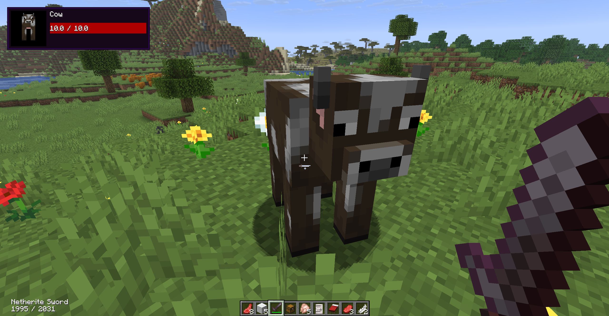
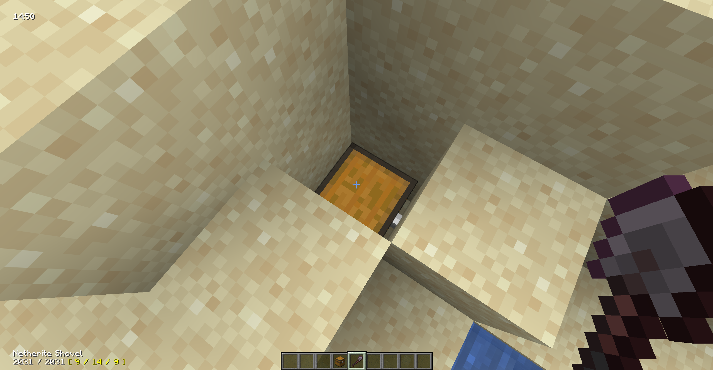

# StatusHUD

**StatusHUD** is a lightweight client-side mod for Minecraft (NeoForge) that enhances your in-game HUD with useful real-time indicators. It is designed to provide quick access to important gameplay information without cluttering the screen.

## Features

- Damage Indicator
- Active Tool Durability Indicator 

- InGame Time Indicator
- Target Position Indicator (chunk coordinates), very helpful for finding buried treasures.

## Configuration

All features can be enabled / disabled / customized via the config file.

### Available Options

| Option | Description | Default |
|------|------------|--------|
| `bEnableDamageIndicator` | Toggle damage indicator | `true` |
| `bEnableTimeIndicator` | Toggle time display | `true` |
| `bEnableDateIndicator` | Toggle date display *(WIP)* | `false` |
| `bEnableToolDurabilityIndicator` | Toggle tool durability display | `true` |
| `bEnableToolTargetPositionIndicator` | Toggle target block position display | `true` |
| `sTimeIndicatorMode` | Time source: `real` or `game` *(WIP)* | `game` |
| `sDateIndicatorMode` | Date source: `real` or `game` *(WIP)* | `game` |

---

## WIP stands for "Work In Progress"

Some features are still under development and may not work as expected:

- Date Indicator
- Time mode switching
- Date mode switching

Expect bugs or incomplete behavior in these areas.

---

## Installation

1. Install **NeoForge** for your Minecraft version.
2. Download the latest release of **StatusHUD**.
3. Place the `.jar` file into your `mods` folder.
4. Launch the game.

---

## License

This project is licensed under the **GNU General Public License v3.0**.  
You are free to use, modify, and distribute this software under the same license.

See the `LICENSE` file for more details.

---

## Notes

- This mod is purely client-side.
- Designed to be minimalistic and non-intrusive.
- Configuration is accessible via standard NeoForge config system.

---

## Future Plans

- Fully functional date/time modes
- Customizable HUD positioning
- Additional indicators (armor durability, entity armor, biome, weather, moon phase, etc.)
- UI scaling and styling options

---

## Contributing

StatusHUD is free and open source, everyone can fork or modify it, it is also open to your ideas and suggestions. If you have thoughts on new indicators or know how to make the current interface more intuitive, I am happy to receive any feedback. Even a small observation can help make the mod better, so please feel free to share your thoughts and creative concepts.

You can help the project in various ways. If you find a bug or encounter an issue while running the mod, please create a ticket in the issues section.

I am always available and ready to discuss the functionality. You can start a new discussion thread or report a problem directly through the repository. If you do not have a GitHub account or are not sure how to use it to submit your ideas, you can send them to modsuggestions@dev1lroot.com. 

Let's build the ultimate, powerful and customizable HUD with all of the possible features together.